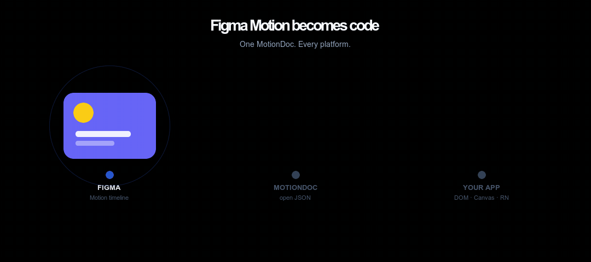

<p align="center">
  <!-- Square mark (not the wide wordmark) — keeps the B icon crisp on GitHub -->
  
</p>

<h1 align="center">Blinn Motion</h1>

<p align="center">
  <strong>Figma Motion → real code.</strong><br />
  The runtime for Figma Motion.<br />
  Designers animate. Engineers ship the same file.
</p>

<p align="center">
  <a href="https://blinnmotion.com">Website</a> ·
  <a href="https://docs.blinnmotion.com">Docs</a> ·
  <a href="https://blinnmotion.com">Live demo</a> ·
  <a href="packages/core/SCHEMA.md">MotionDoc schema</a>
</p>

<p align="center">
  
  
  
  
</p>

<p align="center">
  
</p>

---

Most product motion already lives in **Figma**.  
**Blinn Motion** reads the Motion timeline, turns it into a small open format (**MotionDoc**), and plays it with a **pure-JS render engine**. Same tree, same timing — DOM, Canvas, React, Vue, Svelte, Angular, Lit, React Native.

```
Figma Motion  →  MotionDoc JSON  →  sample(doc, t)  →  DOM · Canvas · React · Vue · Svelte · Angular · Lit · RN
```

No rasterized video. No After Effects detour. No “rebuilt in CSS from a handoff.” Designers ship motion; engineers ship the same file.

---

## Why Blinn Motion?

| | |
|--|--|
| **Figma as source of truth** | Keyframes, cubic-bezier, springs — from the Motion timeline, not re-authored in code. |
| **One pure render method** | `sample(doc, t)` is DOM-free. Every adapter paints the *same* resolved tree. |
| **Product UI, not only illustration** | Real frames: transforms, gradients, borders, masks, path trim, shaders… |
| **Thin adapters** | DOM/CSS, Canvas 2D, React, Vue, Svelte, Angular, Lit, React Native — pick the backend, keep the animation. |
| **Predictable playback** | Shared `Ticker`: play, pause, seek, loop, rate — identical across platforms. |

---

## When to use Blinn

| You want… | Blinn |
|-----------|--------|
| Motion that already lives in **Figma** to ship in the app | ✅ Primary fit |
| Interactive playback (seek, scrub, rate) on web / RN | ✅ |
| A diffable JSON artifact in git / PRs | ✅ MotionDoc |
| Pixel video / GIF for social only | Use export — not Blinn’s job |
| Motion authored only in After Effects | Different pipeline (not our focus) |

---

## Quick start

```bash
npm install @blinn-motion/dom
# or: canvas · react · vue · svelte · angular · lit · react-native
```

### DOM

```ts
import { create } from "@blinn-motion/dom";

const player = create(document.getElementById("stage")!, doc, { loop: true });
player.play();
// player.pause() · seek(1.2) · setProgress(0.5) · setRate(2)
// setProgress(0…1) — scroll / gesture / any external signal
```

### React

```tsx
import { BlinnMotion } from "@blinn-motion/react";

// clock-driven
<BlinnMotion doc={doc} renderer="canvas" loop autoplay />

// progress-driven (scroll, drag, state)
<BlinnMotion doc={doc} progress={scrollP} />
```

### Canvas

```ts
import { create } from "@blinn-motion/canvas";

create(document.querySelector("canvas")!, doc, { autoplay: true, dpr: 2 });
```

A MotionDoc is plain JSON. Export one from the **Figma plugin**, or start from [`fixtures/card.motion.json`](fixtures/card.motion.json).

---

## Platforms

| Package | Role |
|---------|------|
| [`@blinn-motion/core`](packages/core) | Render engine — `sample`, easing, interpolation, `Ticker` |
| [`@blinn-motion/dom`](packages/dom) | Full-fidelity DOM / CSS / SVG |
| [`@blinn-motion/canvas`](packages/canvas) | Pure 2D canvas |
| [`@blinn-motion/react`](packages/react) | `<BlinnMotion />` + `useBlinnMotion` |
| [`@blinn-motion/react-native`](packages/react-native) | `<BlinnMotionView />` |
| [`@blinn-motion/vue`](packages/vue) | Vue 3 `<BlinnMotion />` + composable |
| [`@blinn-motion/svelte`](packages/svelte) | Svelte `use:blinnMotion` action |
| [`@blinn-motion/angular`](packages/angular) | Angular standalone `<blinn-motion>` |
| [`@blinn-motion/lit`](packages/lit) | Lit / `<blinn-motion>` custom element |
| [`@blinn-motion/figma-plugin`](packages/figma-plugin) | Export MotionDoc + live preview |

### SEO & social previews

Landing, docs, and labs share OG thumbnails, `robots.txt` / sitemaps, and `llms.txt` for agents.
See [`docs/SEO.md`](docs/SEO.md). Regenerate images: `npm run og`. Production QA: `npm run seo:qa`.

### Examples

Each example under [`examples/`](examples/) implements the **same advanced demo flow** (doc switch, dual DOM/Canvas on web, transport, scrub, rate, progress-driven mode, live time/fraction). See [`examples/_shared/flow.md`](examples/_shared/flow.md).

| Example | Stack |
|---------|--------|
| [`examples/vanilla`](examples/vanilla) | DOM + Canvas (no framework) |
| [`examples/react`](examples/react) | React + Vite |
| [`examples/react-native`](examples/react-native) | React Native |
| [`examples/vue`](examples/vue) | Vue 3 + `@blinn-motion/vue` |
| [`examples/svelte`](examples/svelte) | Svelte 5 + `@blinn-motion/svelte` |
| [`examples/angular`](examples/angular) | Angular 19 + `@blinn-motion/angular` |
| [`examples/lit`](examples/lit) | Lit + `@blinn-motion/lit` |
| [`examples/next`](examples/next) | Next.js App Router + React adapter |
| [`examples/astro`](examples/astro) | Astro islands (React + Lit) |
| [`examples/expo`](examples/expo) | Expo + React Native adapter |

---

## How it works

```
┌─────────────────┐     ┌──────────────┐     ┌────────────────────┐
│  Figma Motion   │────▶│  MotionDoc   │────▶│  sample(doc, t)    │
│  timelines      │     │  (JSON)      │     │  pure, DOM-free    │
└─────────────────┘     └──────────────┘     └─────────┬──────────┘
                                                       │
                         resolved RenderNode tree ─────┤
                                                       ▼
                    ┌──────┬────────┬───────┬─────┬────────┬─────┬──────┐
                    │ DOM  │ Canvas │ React │ Vue │ Svelte │ Lit │  RN  │
                    └──────┴────────┴───────┴─────┴────────┴─────┴──────┘
```

The maths lives in **core**. Adapters only paint.  
Full format: [**MotionDoc schema**](packages/core/SCHEMA.md) · walkthrough: [**docs**](https://docs.blinnmotion.com).

---

## From Figma

1. Install the Blinn Motion plugin (import [`packages/figma-plugin/manifest.json`](packages/figma-plugin/manifest.json) in Figma → Plugins → Development).
2. Select a frame with a Motion timeline → run the plugin.
3. Preview live, inspect the MotionDoc, **Download .json**.
4. Drop that file into any adapter above.

---

## Links

| | |
|--|--|
| 🌐 Site | [blinnmotion.com](https://blinnmotion.com) |
| 📚 Docs | [docs.blinnmotion.com](https://docs.blinnmotion.com) |
| 🧪 Schema | [`packages/core/SCHEMA.md`](packages/core/SCHEMA.md) |
| 🎞 Fixture | [`fixtures/card.motion.json`](fixtures/card.motion.json) |

---

## Contributing

Issues and PRs welcome. Library packages live under `packages/*`; marketing site under `site/`; docs under `docs/`.

```bash
npm install
npm test
npm run build
```

---

## License

[MIT](LICENSE) © Blinn Motion
